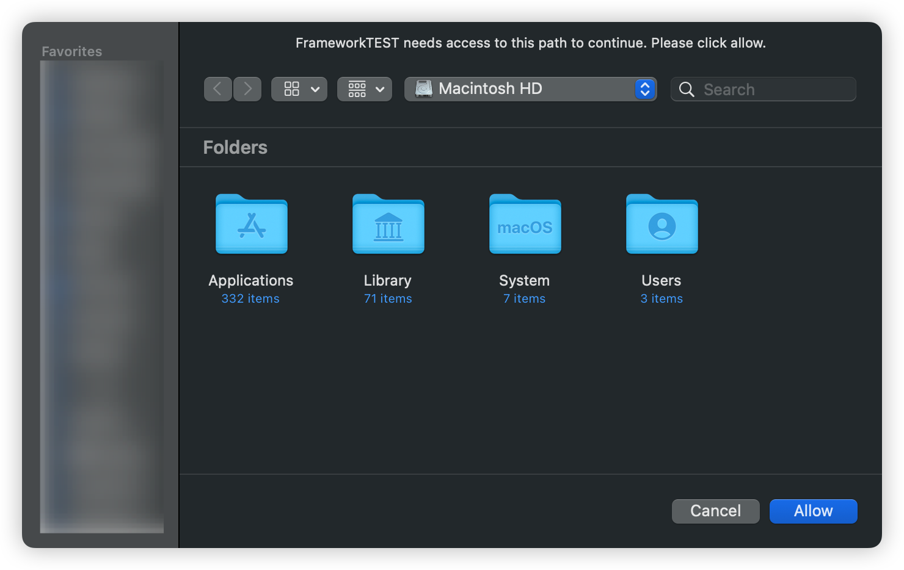

<p align="center">


<p align="center"> <b> LCAppSandboxFileKit 是一个用于写入和访问 macOS 应用程序沙盒文件之外的文件的功能的框架！</b></p>


<p align="center">
  <a href="https://swiftpackageindex.com/DevLiuSir/LCAppSandboxFileKit">
        
    </a>
    <a href="https://swiftpackageindex.com/DevLiuSir/LCAppSandboxFileKit">
        
    </a>


<a href="https://twitter.com/LiuChuan_"></a>
</p>


> [中文](README_CN.md) | [English](README.md)


## 如何使用

- 定义需要授权的路径

```swift
let authorizedDirectory = "/"

```

- 清除指定路径的访问权限


```swift
LCAppSandboxFileKit.standard.clearAccessForPath(authorizedDirectory) { status in
    if status {
        print("Successfully cleared access to the root directory.")
    } else {
        print("Failed to clear access to the root directory.")
    }
}
```


- 清除所有路径的访问权限

```swift
LCAppSandboxFileKit.standard.clearAllBookmarkData()
```


- 检查目录是否有访问权限

```swift
let isPermiss = LCAppSandboxFileKit.standard.checkAccessForPath(authorizedDirectory)
if isPermiss {
    print("Directory access granted, starting search.")
} else { // No access, request permission
    print("No directory access, requesting permission.")
    LCAppSandboxFileKit.standard.requestAccessForPath(authorizedDirectory, canChooseDirectories: true) { status in
        if status {
            print("Permission granted, proceeding with the process.")
        } else {
            print("Failed to obtain permission.")
        }
    }
}
```


- 请求指定路径的访问权限，自定义面板信息

```swift
 LCAppSandboxFileKit.standard.requestAccessForPath("/", title: "custom title", panelButtonTitle: "button title", canChooseDirectories: true) { status in
     if status {
        print("Permission granted, proceeding with the process.")
    } else {
        print("Failed to obtain permission.")
    }
}
```


- 请求指定路径的访问权限，是否显示附件面板

```swift
 LCAppSandboxFileKit.standard.requestAccessForPath("/Users", isRootOptionEnabled: true, canChooseDirectories: true) { status in
     if status {
        print("Permission granted, proceeding with the process.")
    } else {
        print("Failed to obtain permission.")
    }
}
```


### 设计

|  |
| :------------: |
| 附件面板 |

| |
| :------------: |
| 普通 |


## 安装

### CocoaPods
PermissionsKit 可通过 [CocoaPods](https://cocoapods.org) 获取。要安装它，只需将以下行添加到您的 Podfile 中：


```swift

pod 'LCAppSandboxFileKit'

```


### SwiftPackage

添加 `https://github.com/DevLiuSir/LCAppSandboxFileKit.git`  [Xcode 中的“Swift Package Manager”选项卡](https://developer.apple.com/documentation/xcode/adding_package_dependencies_to_your_app).


## 许可证

MIT License

Copyright (c) 2024 Marvin


## 作者

| [](https://github.com/DevLiuSir)  |  [DevLiuSir](https://github.com/DevLiuSir)<br/><br/><sub>Software Engineer</sub><br/> [][1] [][2] [][3]|
| :------------: | :------------: |

[1]: https://twitter.com/LiuChuan_
[2]: https://github.com/DevLiuSir
[3]: https://devliusir.com/